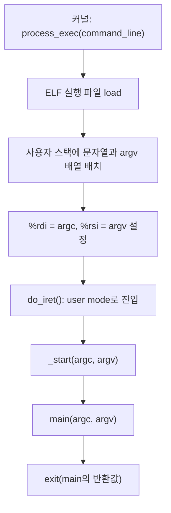
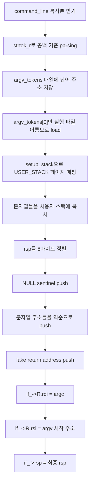

# Argument Passing 이론과 구현 가이드

이 문서는 Pintos Project 2의 `Argument Passing`을 처음 보는 사람 기준으로 설명합니다. 목표는 사용자 프로그램이 시작될 때 `main(int argc, char *argv[])`가 올바른 값을 받도록 커널이 초기 사용자 스택과 레지스터를 준비하는 것입니다.

## 한 줄 요약

사용자가 다음처럼 프로그램을 실행한다고 해 봅시다.

```text
args-multiple some arguments for you!
```

커널은 이 문자열을 다음처럼 나눠야 합니다.

```text
argv[0] = "args-multiple"
argv[1] = "some"
argv[2] = "arguments"
argv[3] = "for"
argv[4] = "you!"
argc = 5
```

그리고 사용자 프로그램이 시작되기 직전에 다음 상태를 만들어야 합니다.

```text
%rdi = argc
%rsi = argv
%rsp = 잘 구성된 사용자 스택의 시작 위치
```

사용자 프로그램 입장에서는 마치 누군가가 평범하게 `main(argc, argv)`를 호출해 준 것처럼 보여야 합니다.

## 왜 커널이 인자를 직접 넣어야 할까?

Pintos의 사용자 프로그램은 `main()`에서 바로 시작하지 않습니다. 실제 entry point는 `lib/user/entry.c`의 `_start()`입니다.

```c
void
_start (int argc, char *argv[]) {
    exit (main (argc, argv));
}
```

즉 흐름은 다음과 같습니다.



일반적인 C 프로그램에서는 OS가 프로세스를 시작할 때 이미 `argc`, `argv`를 준비해 줍니다. Pintos에서는 우리가 직접 그 OS 역할을 구현해야 합니다.

## x86-64에서 함수 인자는 어디로 갈까?

x86-64 System V ABI에서는 정수나 포인터 인자를 앞에서부터 레지스터에 넣습니다.

| 순서 | 레지스터 | `_start()`에서의 의미 |
| --- | --- | --- |
| 1번째 인자 | `%rdi` | `argc` |
| 2번째 인자 | `%rsi` | `argv` |
| 3번째 인자 | `%rdx` | 이번 과제에서는 사용하지 않음 |
| 4번째 인자 | `%rcx` | 이번 과제에서는 사용하지 않음 |
| 5번째 인자 | `%r8` | 이번 과제에서는 사용하지 않음 |
| 6번째 인자 | `%r9` | 이번 과제에서는 사용하지 않음 |

따라서 Pintos에서 argument passing을 구현할 때 가장 중요한 레지스터는 두 개입니다.

```c
if_->R.rdi = argc;
if_->R.rsi = (uint64_t) argv_start_address;
```

여기서 `if_`는 `struct intr_frame *`입니다. 이 구조체는 `do_iret()`이 user mode로 넘어갈 때 CPU 레지스터 상태로 복원됩니다.

## 스택에는 무엇을 넣어야 할까?

예시로 다음 명령을 보겠습니다.

```text
/bin/ls -l foo bar
```

이 명령은 네 단어로 나뉩니다.

```text
"/bin/ls", "-l", "foo", "bar"
```

사용자 프로그램이 기대하는 형태는 다음과 같습니다.

```c
argc == 4
argv[0] == "/bin/ls"
argv[1] == "-l"
argv[2] == "foo"
argv[3] == "bar"
argv[4] == NULL
```

주의할 점은 `argv` 자체가 문자열 배열이 아니라, 문자열을 가리키는 포인터들의 배열이라는 것입니다.

```text
argv
 |
 v
+---------+      +----------+
| argv[0] | ---> | /bin/ls\0 |
+---------+      +----------+
| argv[1] | ---> | -l\0      |
+---------+      +----------+
| argv[2] | ---> | foo\0     |
+---------+      +----------+
| argv[3] | ---> | bar\0     |
+---------+      +----------+
| argv[4] | ---> NULL
+---------+
```

## 스택은 아래로 자란다

Pintos의 사용자 스택은 `USER_STACK`에서 시작합니다. 스택은 높은 주소에서 낮은 주소 방향으로 자랍니다.

```text
높은 주소
USER_STACK
    |
    v
+----------------------------+
| 문자열들: "bar\0" 등        |
+----------------------------+
| padding: 8바이트 정렬용     |
+----------------------------+
| NULL sentinel: argv[argc]   |
+----------------------------+
| argv 포인터들               |
+----------------------------+
| fake return address         |
+----------------------------+
낮은 주소
```

`/bin/ls -l foo bar`의 최종 스택 예시는 다음과 같습니다.

| Address | Name | Data | Type |
| --- | --- | --- | --- |
| `0x4747fffc` | `argv[3][...]` | `'bar\0'` | `char[4]` |
| `0x4747fff8` | `argv[2][...]` | `'foo\0'` | `char[4]` |
| `0x4747fff5` | `argv[1][...]` | `'-l\0'` | `char[3]` |
| `0x4747ffed` | `argv[0][...]` | `'/bin/ls\0'` | `char[8]` |
| `0x4747ffe8` | `word-align` | `0` | `uint8_t[]` |
| `0x4747ffe0` | `argv[4]` | `0` | `char *` |
| `0x4747ffd8` | `argv[3]` | `0x4747fffc` | `char *` |
| `0x4747ffd0` | `argv[2]` | `0x4747fff8` | `char *` |
| `0x4747ffc8` | `argv[1]` | `0x4747fff5` | `char *` |
| `0x4747ffc0` | `argv[0]` | `0x4747ffed` | `char *` |
| `0x4747ffb8` | `return address` | `0` | `void (*) ()` |

이때 레지스터는 다음처럼 설정됩니다.

```text
RDI: 4
RSI: 0x4747ffc0
RSP: 0x4747ffb8
```

## 왜 8바이트 정렬이 필요할까?

테스트 프로그램 `pintos/tests/userprog/args.c`에는 이런 검사가 있습니다.

```c
if (((unsigned long long) argv & 7) != 0)
  msg ("argv and stack must be word-aligned, actually %p", argv);
```

`argv` 주소가 8의 배수가 아니면 실패 메시지가 찍힙니다. x86-64에서 포인터 크기는 8바이트이고, word-aligned access가 더 빠르고 ABI 관점에서도 안전하기 때문에 `argv` 배열을 넣기 전에 stack pointer를 8바이트 경계에 맞춰야 합니다.

정렬은 보통 이런 의미입니다.

```text
rsp = rsp & ~0x7
```

즉 현재 주소를 8의 배수로 내립니다.

## 구현 흐름

전체 구현 흐름은 다음 순서로 생각하면 됩니다.



## 어느 파일의 어느 코드에 구현해야 할까?

### 1. `pintos/userprog/process.c`의 `process_exec()`

현재 핵심 코드는 다음 흐름입니다.

```c
int
process_exec (void *f_name) {
    char *file_name = f_name;
    ...
    process_cleanup ();
    success = load (file_name, &_if);
    palloc_free_page (file_name);
    ...
}
```

여기서 `file_name`은 사실 파일 이름만이 아니라 전체 command line입니다.

```text
"args-multiple some arguments for you!"
```

따라서 `process_exec()` 또는 `load()`에서 이 문자열을 parsing해야 합니다.

구현해야 할 기능은 다음과 같습니다.

- 전체 command line을 공백 기준으로 나누기
- 여러 공백은 하나의 공백처럼 처리하기
- 첫 번째 token을 실행 파일 이름으로 사용하기
- 전체 token 목록은 나중에 사용자 스택에 올릴 수 있게 보관하기
- `palloc_free_page(file_name)` 전에 필요한 데이터가 모두 사용자 스택에 복사되도록 하기

초보자에게 가장 덜 헷갈리는 구조는 다음 둘 중 하나입니다.

- `process_exec()`에서 parsing한 뒤 `load(program_name, &_if, argc, argv)`처럼 `load()`의 인자를 확장한다.
- `load()` 안에서 command line을 parsing하고, `filesys_open()`에는 첫 번째 token만 넘긴다.

어느 방식을 쓰든 핵심은 같습니다. `filesys_open()`에 `"args-multiple some arguments for you!"` 전체를 넘기면 안 되고, `"args-multiple"`만 넘겨야 합니다.

### 2. `pintos/userprog/process.c`의 `load()`

현재 `load()` 안에는 다음 코드가 있습니다.

```c
file = filesys_open (file_name);
```

argument passing 구현 후에는 `file_name`이 아니라 program name만 열어야 합니다.

```text
command line: "args-single onearg"
open해야 하는 파일: "args-single"
argv로 전달해야 하는 값: ["args-single", "onearg"]
```

또한 `load()` 아래쪽에는 이미 TODO가 있습니다.

```c
/* TODO: Your code goes here.
 * TODO: Implement argument passing (see project2/argument_passing.html). */
```

여기 또는 이 근처에서 다음을 수행해야 합니다.

- `setup_stack(if_)` 이후, `if_->rsp`가 `USER_STACK`을 가리키는 상태에서 인자들을 스택에 쌓기
- 최종 `if_->rsp` 갱신하기
- `if_->R.rdi`에 `argc` 넣기
- `if_->R.rsi`에 `argv[0]` 주소 넣기

### 3. `pintos/userprog/process.c`의 `setup_stack()`

Project 2 기준으로 실제로 쓰이는 구현은 `#ifndef VM` 블록 안의 `setup_stack()`입니다.

```c
static bool
setup_stack (struct intr_frame *if_) {
    ...
    if (success)
        if_->rsp = USER_STACK;
    ...
}
```

이 함수는 사용자 스택으로 사용할 page 하나를 매핑하고, `if_->rsp = USER_STACK`으로 초기화합니다. Argument passing은 이 `rsp`를 아래로 내리면서 데이터를 써 넣는 작업입니다.

여기 안에 argument passing을 직접 넣을 수도 있지만, 보통은 별도 helper를 만드는 편이 읽기 좋습니다.

```c
static bool setup_argument_stack (struct intr_frame *if_, int argc, char **argv);
```

### 4. `pintos/userprog/process.c`의 `process_wait()`

현재 `process_wait()`는 즉시 `-1`을 반환합니다.

```c
int
process_wait (tid_t child_tid UNUSED) {
    return -1;
}
```

`pintos/threads/init.c`의 `run_task()`는 사용자 프로그램을 이렇게 실행합니다.

```c
process_wait (process_create_initd (task));
```

따라서 `process_wait()`가 바로 반환하면 커널이 사용자 프로그램 출력을 기다리지 않고 다음으로 넘어갈 수 있습니다. 현재 생성된 `.output`에서 `(args) begin` 같은 사용자 프로그램 출력이 아예 없는 이유도 이 흐름과 관련될 수 있습니다.

최종적으로 테스트를 안정적으로 통과하려면 `process_wait()`가 자식 프로세스가 종료될 때까지 기다리고, 자식의 exit status를 반환해야 합니다. 다만 argument passing을 먼저 디버깅하는 단계에서는 이 문제가 별도의 큰 과제처럼 느껴질 수 있으므로, 적어도 "왜 출력이 안 보이는지"를 기억해 두면 좋습니다.

## 실제로 스택에 쌓는 순서

예시 명령입니다.

```text
args-single onearg
```

1. token으로 나눕니다.

```text
argv[0] = "args-single"
argv[1] = "onearg"
argc = 2
```

2. 문자열을 스택에 복사합니다. 보통 뒤 token부터 복사하면 편합니다.

```text
copy "onearg\0"
copy "args-single\0"
```

3. 각 문자열이 복사된 사용자 주소를 kernel local 배열에 저장합니다.

```text
arg_addr[0] = "args-single\0"이 놓인 사용자 주소
arg_addr[1] = "onearg\0"이 놓인 사용자 주소
```

4. `rsp`를 8바이트 정렬합니다.

5. `argv[argc] == NULL`이 되도록 null pointer를 push합니다.

6. `arg_addr[argc - 1]`부터 `arg_addr[0]`까지 역순으로 push합니다.

7. 이때의 `rsp`가 `argv[0]`의 주소입니다. 이 값을 `%rsi`에 넣습니다.

8. fake return address `0`을 push합니다.

9. `%rdi = argc`, `%rsi = argv_start`, `%rsp = final_rsp`로 설정합니다.

## 흔한 실수

- `filesys_open()`에 전체 command line을 넘긴다.
  - `"args-single onearg"`라는 파일은 없으므로 load가 실패합니다.

- 문자열은 복사했지만 `argv` 포인터 배열을 만들지 않는다.
  - 사용자 프로그램의 `argv[i]`가 엉뚱한 주소를 가리킵니다.

- `argv[argc] = NULL`을 빠뜨린다.
  - `args.c`는 `i <= argc`까지 출력하므로 마지막 null이 반드시 필요합니다.

- `%rdi`, `%rsi`를 설정하지 않는다.
  - `_start(argc, argv)`가 쓰레기 값을 받습니다.

- 8바이트 정렬을 하지 않는다.
  - `args.c`의 word-aligned 검사에 걸립니다.

- command line parsing 중 여러 공백을 빈 인자로 취급한다.
  - `args-dbl-space`가 실패합니다.

- `palloc_free_page(file_name)` 후에 그 안의 token 포인터를 사용한다.
  - parsing 결과가 원래 page 안을 가리키는 경우, page를 해제한 뒤 접근하면 위험합니다.
  - 안전한 흐름은 `palloc_free_page(file_name)` 전에 모든 문자열을 사용자 스택에 복사하는 것입니다.

## 5개 테스트가 요구하는 기능

다섯 테스트는 모두 같은 사용자 프로그램인 `pintos/tests/userprog/args.c`를 사용합니다. 이 프로그램은 받은 `argc`, `argv`를 출력합니다.

```c
msg ("argc = %d", argc);
for (i = 0; i <= argc; i++)
  if (argv[i] != NULL)
    msg ("argv[%d] = '%s'", i, argv[i]);
  else
    msg ("argv[%d] = null", i);
```

즉 테스트들은 커널이 `argc`, `argv`, `argv[argc]`, 정렬을 제대로 준비했는지 확인합니다.

### 1. `args-none`

실행 형태:

```text
args-none
```

기대값:

```text
argc = 1
argv[0] = 'args-none'
argv[1] = null
```

요구 기능:

- 인자가 없어도 프로그램 이름 자체는 `argv[0]`에 들어가야 합니다.
- `argc`는 0이 아니라 1입니다.
- `argv[argc]`, 즉 `argv[1]`은 null이어야 합니다.

### 2. `args-single`

실행 형태:

```text
args-single onearg
```

기대값:

```text
argc = 2
argv[0] = 'args-single'
argv[1] = 'onearg'
argv[2] = null
```

요구 기능:

- 프로그램 이름과 첫 번째 인자를 분리해야 합니다.
- `filesys_open()`은 `args-single`만 열어야 합니다.
- 사용자 프로그램에는 `onearg`가 `argv[1]`로 전달되어야 합니다.

### 3. `args-multiple`

실행 형태:

```text
args-multiple some arguments for you!
```

기대값:

```text
argc = 5
argv[0] = 'args-multiple'
argv[1] = 'some'
argv[2] = 'arguments'
argv[3] = 'for'
argv[4] = 'you!'
argv[5] = null
```

요구 기능:

- 여러 개의 인자를 순서대로 parsing해야 합니다.
- `argv` 포인터 배열의 순서가 문자열 순서와 일치해야 합니다.
- 스택에 문자열을 어떤 순서로 복사하든, `argv[0]`부터 `argv[4]`까지는 올바른 순서로 보여야 합니다.

### 4. `args-many`

실행 형태:

```text
args-many a b c d e f g h i j k l m n o p q r s t u v
```

기대값:

```text
argc = 23
argv[0] = 'args-many'
argv[1] = 'a'
...
argv[22] = 'v'
argv[23] = null
```

요구 기능:

- 인자 개수가 많아도 처리할 수 있어야 합니다.
- local 배열 크기를 너무 작게 잡으면 실패합니다.
- 과제 설명처럼 command line 전체를 한 page, 즉 4 kB 이내로 제한하는 정도는 합리적입니다.

### 5. `args-dbl-space`

실행 형태:

```text
args-dbl-space two  spaces!
```

`two`와 `spaces!` 사이에 공백이 두 개 있습니다.

기대값:

```text
argc = 3
argv[0] = 'args-dbl-space'
argv[1] = 'two'
argv[2] = 'spaces!'
argv[3] = null
```

요구 기능:

- 연속된 공백을 빈 문자열 인자로 만들면 안 됩니다.
- `"two  spaces!"`는 `"two"`와 `"spaces!"` 두 인자로 해석되어야 합니다.
- `strtok_r(command, " ", &save_ptr)`를 쓰면 이 요구사항을 자연스럽게 만족할 수 있습니다.

## 현재 스크린샷과 실패 상황 해석

첨부한 화면에서는 `User Programs 0/66 passed`, `Args 0/5 passed` 상태이고, 일부 테스트는 `Not run`, 일부는 `FAIL`로 보입니다.

이 상태에서 우선 의심할 지점은 두 가지입니다.

1. `process_exec()` 또는 `load()`가 command line 전체를 실행 파일 이름으로 취급하고 있다.
2. `process_wait()`가 즉시 반환해서 사용자 프로그램의 출력과 종료 상태를 제대로 기다리지 않는다.

현재 저장소의 `process.c` 기준으로는 `load(file_name, &_if)`에 전체 문자열이 들어갈 수 있고, `filesys_open(file_name)`도 그대로 호출됩니다. 또한 `process_wait()`는 바로 `-1`을 반환합니다. 따라서 argument passing 구현과 wait 구현은 테스트 통과를 위해 서로 맞물려 있습니다.

## 추천 구현 단위

처음부터 완벽하게 하려고 하면 헷갈리기 쉬우니 다음 순서로 나누면 좋습니다.

1. `process_exec()`에서 command line을 token으로 나눈다.
2. 첫 token만 program name으로 사용해서 `load()`가 파일을 열게 한다.
3. `setup_stack()` 이후 사용자 스택에 문자열들을 복사한다.
4. `argv` 포인터 배열과 null sentinel을 스택에 쌓는다.
5. `if_->R.rdi`, `if_->R.rsi`, `if_->rsp`를 설정한다.
6. `args-none`과 `args-single`부터 확인한다.
7. `args-multiple`, `args-many`로 인자 개수 처리를 확인한다.
8. `args-dbl-space`로 여러 공백 처리를 확인한다.
9. 사용자 프로그램 출력이 아예 보이지 않는다면 `process_wait()` 흐름을 확인한다.

## 디버깅 팁

`hex_dump()`를 사용하면 사용자 스택에 실제로 어떤 바이트가 들어갔는지 볼 수 있습니다.

```c
hex_dump (if_->rsp, if_->rsp, USER_STACK - if_->rsp, true);
```

단, 출력이 너무 길어질 수 있으니 임시 디버깅용으로만 사용하는 것이 좋습니다.

성공적으로 구성된 스택에서는 다음을 눈으로 확인할 수 있어야 합니다.

- 문자열들이 `\0`으로 끝난다.
- `argv[argc]` 위치에 0이 있다.
- `argv[0]`, `argv[1]` 등이 문자열이 놓인 주소를 가리킨다.
- 최종 `rsp`가 fake return address 위치를 가리킨다.
- `%rsi`가 `argv[0]`의 주소를 가리킨다.
