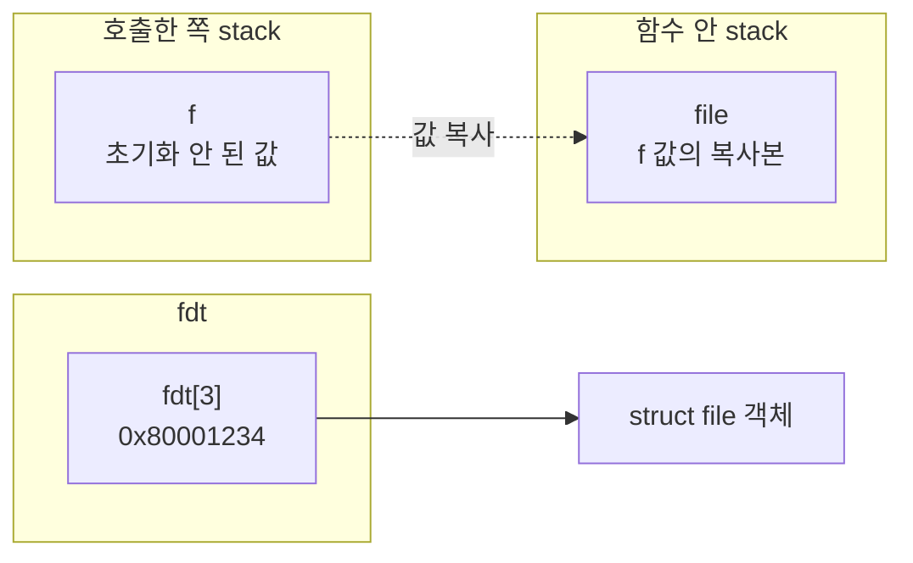
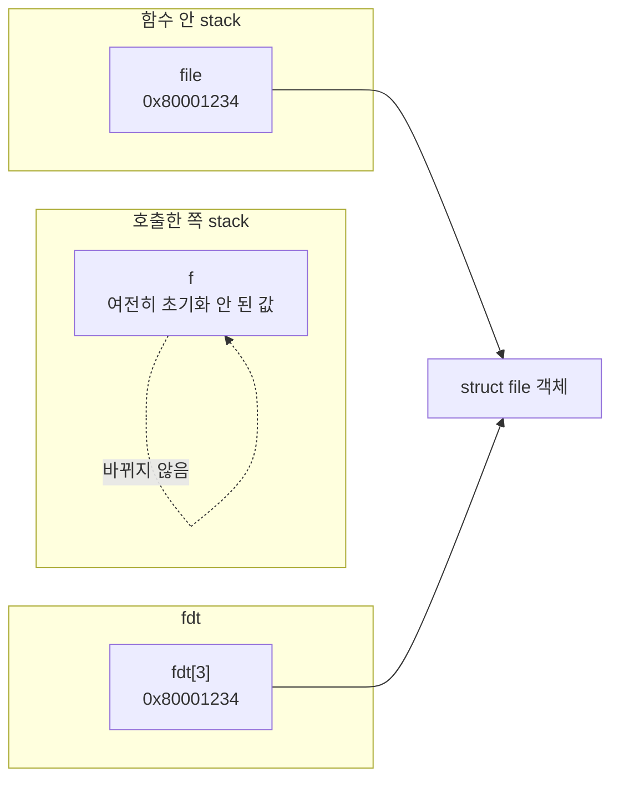
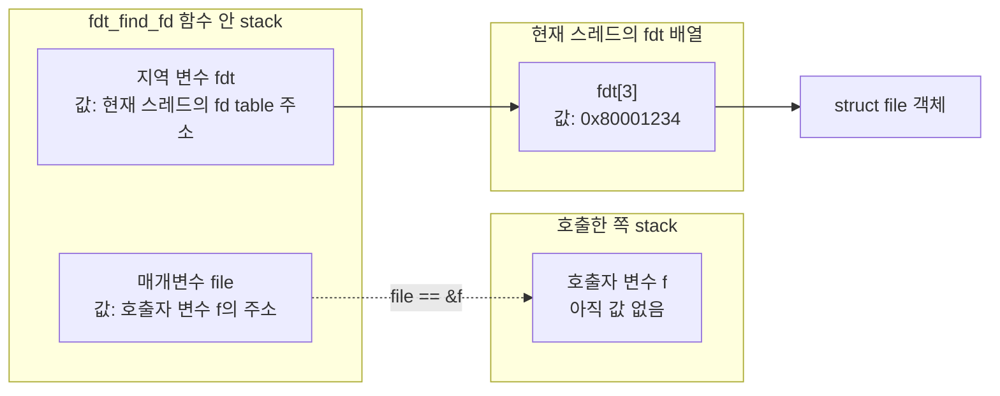
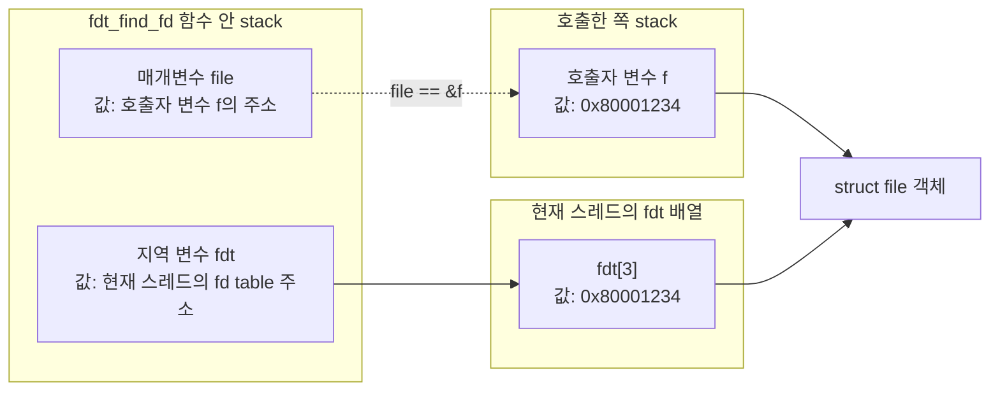

# syscall 구현 전 필수 학습

이 문서는 Pintos에서 syscall을 구현하기 전에 왜 `user pointer 검증`, `file descriptor table`, `lock`을 먼저 떠올려야 하는지 정리한다.

syscall은 유저 프로그램이 커널에게 서비스를 요청하는 통로다. 따라서 syscall 구현은 단순히 함수 하나를 채우는 일이 아니라, 유저 영역과 커널 영역의 경계, 프로세스별 자원 관리, 공유 자원 동기화를 다루는 일이다.

## 0. 무엇을 먼저 학습해야 하는지 파악하는 방법

syscall 구현 전 필요한 내용을 파악하려면, 먼저 syscall이 지나가는 전체 경로를 따라가야 한다.

1. 유저 프로그램이 `lib/user/syscall.c`의 wrapper 함수를 호출한다.
2. wrapper는 syscall 번호와 인자를 레지스터에 넣고 `syscall` 명령을 실행한다.
3. CPU가 커널 모드로 전환되고 `userprog/syscall-entry.S`를 거쳐 `syscall_handler()`로 들어온다.
4. 커널은 syscall 번호를 보고 필요한 작업을 수행한다.
5. 반환값을 레지스터에 넣고 유저 프로그램으로 돌아간다.

이 흐름을 보면 syscall 구현 전 반드시 물어야 하는 질문이 생긴다.

- 유저가 넘긴 주소를 커널이 그대로 믿어도 되는가?
- 열린 파일 같은 자원은 프로세스마다 어떻게 구분하는가?
- 여러 프로세스가 같은 파일 시스템에 동시에 접근하면 안전한가?

이 질문에서 자연스럽게 세 가지 주제가 나온다.

- `user pointer 유효성 검사`: 유저가 넘긴 주소가 커널에서 접근 가능한 안전한 주소인지 확인해야 한다.
- `fd / fdt`: 유저 프로그램은 파일 객체를 직접 만지지 않고 정수 fd로 접근하므로, 프로세스마다 fd를 파일 객체에 매핑하는 테이블이 필요하다.
- `lock`: 파일 시스템 같은 공유 자원은 여러 프로세스가 동시에 접근할 수 있으므로 임계 구역 보호가 필요하다.

즉 이 세 가지는 외워서 나오는 항목이 아니라, syscall 경로를 따라가며 "커널이 유저 요청을 대신 수행할 때 무엇을 믿을 수 있고, 무엇을 분리해야 하며, 무엇을 보호해야 하는가"를 질문하면 도출된다.

학습할 때는 다음 순서가 좋다.

1. syscall calling convention

   syscall 번호와 인자가 어느 레지스터로 전달되는지 확인한다. Pintos x86-64에서는 보통 syscall 번호가 `rax`, 인자가 `rdi`, `rsi`, `rdx`, `r10`, `r8`, `r9` 순서로 전달된다.

2. 유저 주소와 커널 주소의 차이

   유저 프로그램이 넘긴 포인터는 커널 입장에서 신뢰할 수 없는 입력이다. 이 주소가 유저 영역인지, 매핑된 페이지인지, 읽기/쓰기가 가능한지 확인해야 한다.

3. 프로세스별 상태

   각 프로세스는 열린 파일 목록, 다음 fd 번호, 실행 파일 정보 같은 독립적인 상태를 가져야 한다. 이 상태는 보통 `struct thread`에 둔다. Pintos에서는 유저 프로세스도 커널 스레드 하나로 표현되기 때문이다.

4. 파일 시스템 동기화

   `filesys`, `file`, `inode` 계층이 여러 스레드에서 동시에 호출될 수 있는지 확인한다. Pintos 기본 파일 시스템은 syscall 레벨에서 큰 lock 하나로 보호하는 방식으로 시작하는 경우가 많다.

5. 실패 시 종료 정책

   잘못된 유저 포인터, 존재하지 않는 fd, 권한 없는 접근 같은 오류가 발생했을 때 syscall이 어떤 값을 반환할지, 또는 프로세스를 종료할지 정해야 한다.

## 1. 세 가지 항목이 필수적인 이유

### 1. user pointer 유효성 검사

syscall 인자는 유저 프로그램이 만든 값이다. `write(fd, buffer, size)`에서 `buffer`는 유저 주소다. 커널이 이 주소를 그대로 역참조하면 문제가 생긴다.

예를 들어 유저 프로그램이 다음과 같은 값을 넘길 수 있다.

- `NULL`
- 커널 주소 영역을 가리키는 포인터
- 매핑되지 않은 주소
- 문자열 중간까지만 유효하고 뒤쪽은 페이지 fault가 나는 주소
- 읽기 전용 영역인데 쓰려고 하는 주소

커널이 이런 주소를 검증하지 않고 접근하면 커널 panic이 발생하거나, 유저 프로그램이 커널 메모리를 읽고 쓰는 보안 문제가 생긴다.

따라서 syscall은 유저 포인터를 사용할 때마다 "이 주소는 유저 영역인가", "현재 프로세스의 페이지 테이블에 매핑되어 있는가", "필요한 접근 권한이 있는가"를 확인해야 한다.

Pintos에서 특히 중요한 syscall은 다음과 같다.

- `write(fd, buffer, size)`: `buffer`부터 `size` 바이트를 읽을 수 있어야 한다.
- `read(fd, buffer, size)`: `buffer`부터 `size` 바이트를 쓸 수 있어야 한다.
- `exec(file)`, `open(file)`: 문자열 포인터가 유효해야 하고, `\0`을 만날 때까지 안전하게 읽을 수 있어야 한다.

### 2. fd와 프로세스별 fdt

유저 프로그램은 커널 내부의 `struct file *`을 직접 받을 수 없다. 대신 정수 fd를 받는다.

예를 들어 유저 프로그램 입장에서는 다음처럼 보인다.

```c
int fd = open("a.txt");
write(fd, buffer, size);
close(fd);
```

하지만 커널 내부에서는 `fd`를 실제 열린 파일 객체와 연결해야 한다. 이 연결 정보를 저장하는 것이 file descriptor table, 즉 fdt다.

fdt가 프로세스마다 있어야 하는 이유는 fd 번호가 프로세스 안에서만 의미 있기 때문이다.

예를 들어 A 프로세스의 `fd 3`과 B 프로세스의 `fd 3`은 서로 다른 파일일 수 있다. 만약 전역 테이블 하나만 대충 쓰면 한 프로세스가 다른 프로세스의 파일을 닫거나, 잘못된 파일에 읽기/쓰기를 할 수 있다.

따라서 각 스레드 또는 프로세스는 보통 다음 상태를 가진다.

- fd 번호에서 `struct file *`로 가는 매핑
- 다음에 할당할 fd 번호
- `stdin`, `stdout`처럼 예약된 fd 처리
- `close` 시 fd 제거와 file close 처리

Pintos에서는 유저 프로세스가 `struct thread`로 관리되므로, fdt도 보통 `struct thread` 안에 넣는다.

### 3. lock

syscall은 여러 유저 프로세스가 동시에 호출할 수 있다. 특히 파일 시스템은 공유 자원이다.

예를 들어 두 프로세스가 동시에 `write()`를 호출하거나, 한 프로세스가 `open()`하는 동안 다른 프로세스가 `remove()`를 호출할 수 있다. 내부 자료구조가 동시 접근을 고려하지 않았다면 데이터가 깨질 수 있다.

lock이 필요한 이유는 다음과 같다.

- 파일 시스템 내부 자료구조를 동시에 수정하지 못하게 막는다.
- `file_read`, `file_write`, `filesys_open`, `filesys_remove` 같은 연산의 중간 상태가 다른 스레드에 보이지 않게 한다.
- 테스트 출력이나 파일 내용이 비정상적으로 섞이는 문제를 줄인다.

처음 구현에서는 보통 전역 `filesys_lock` 하나로 파일 시스템 syscall 전체를 감싸는 방식이 단순하고 안전하다. 이후 성능을 더 신경 쓴다면 inode별 lock, file별 lock처럼 더 세밀한 동기화를 고려할 수 있다.

## 3. 구현 전 알아야 하는 이론

### user pointer 검증 이론

커널은 유저 포인터를 신뢰하면 안 된다. 유저 포인터는 syscall의 입력값이므로 악의적이거나 잘못될 수 있다.

검증에는 크게 두 접근이 있다.

1. 접근 전에 검사한다.

   주소가 유저 영역인지, 페이지 테이블에 매핑되어 있는지 확인한 뒤 접근한다. Pintos에서는 `is_user_vaddr()`와 페이지 테이블 조회 함수를 조합해 생각할 수 있다.

2. 접근하다 page fault가 나면 처리한다.

   실제 운영체제에서 쓰는 방식에 가깝지만, page fault handler와 복구 흐름을 더 조심스럽게 설계해야 한다.

Pintos 과제에서는 먼저 접근 전 검사를 이해하는 것이 좋다.

포인터 검증에서 특히 주의할 점은 "시작 주소 하나만 검사하면 부족하다"는 것이다. `buffer`가 유효해도 `buffer + size - 1`까지 모두 유효하다는 보장은 없다. 문자열도 마찬가지다. 시작 주소만 유효하고 `\0`을 찾기 전에 다음 페이지에서 fault가 날 수 있다.

따라서 구현 전 다음 개념을 알고 있어야 한다.

- 유저 가상 주소와 커널 가상 주소의 경계
- 페이지 단위 매핑
- 현재 프로세스의 page table
- 읽기 검증과 쓰기 검증의 차이
- 버퍼 검증과 문자열 검증의 차이

### fd / fdt 이론

fd는 커널 객체를 유저 프로그램에 직접 노출하지 않기 위한 핸들이다. 유저는 정수 fd만 알고, 커널은 그 정수를 실제 파일 객체로 바꾼다.

fdt 설계에서 알아야 할 내용은 다음과 같다.

- fd는 프로세스별 namespace다.
- `0`은 보통 stdin, `1`은 stdout으로 예약한다.
- 일반 파일은 보통 `2` 이상의 fd를 할당한다.
- `open()`은 새 fd를 반환한다.
- `read()`와 `write()`는 fd를 찾아 실제 파일 객체에 접근한다.
- `close()`는 fd table에서 항목을 제거하고 파일 객체를 닫는다.
- 프로세스 종료 시 열려 있는 모든 파일을 닫아야 한다.

자료구조는 배열, 리스트, 해시 테이블 등으로 만들 수 있다. Pintos 초반에는 단순 배열이나 리스트로도 충분하다. 중요한 것은 fd 번호와 `struct file *`의 소유권을 프로세스별로 분리하는 것이다.

또한 `fork()`를 구현한다면 부모의 fdt를 자식에게 어떻게 복제할지 고민해야 한다. 같은 파일 객체를 공유할지, `file_duplicate()`로 별도 객체를 만들지에 따라 파일 위치와 close 동작이 달라질 수 있다.

### 포인터 인자와 이중 포인터

`fdt`에서 fd로 `struct file *`을 찾아오는 함수를 만들 때, 포인터 인자가 어떻게 전달되는지 정확히 이해해야 한다.

문제 상황은 다음 코드에서 시작했다.

```c
struct file *f;
if (fdt_find_fd (fd, (void *) f) == false)
	return -1;
```

그리고 `fdt_find_fd()` 내부는 대략 이런 형태였다.

```c
bool
fdt_find_fd (int fd, void *file) {
	void **fdt = thread_current ()->fdt;

	if (fdt[fd] == NULL)
		return false;

	file = fdt[fd];
	return true;
}
```

겉으로 보면 `file = fdt[fd]`를 했으니 호출한 쪽의 `f`에도 파일 주소가 들어갈 것처럼 보인다. 하지만 C에서 함수 인자는 항상 값으로 전달된다. 포인터도 예외가 아니다. 포인터를 넘기면 "주소를 담은 변수 자체"가 넘어가는 것이 아니라, 그 포인터 값의 복사본이 매개변수에 들어간다.

호출 직후 상태를 그림으로 보면 이렇다.



함수 안에서 `file = fdt[fd]`를 실행하면 바뀌는 것은 함수 안의 복사본뿐이다.



즉 `file`은 `struct file` 객체를 가리키게 되었지만, 호출한 쪽의 `f` 변수는 그대로다. 그래서 `fdt_find_fd()` 이후에 `f`를 사용하면 초기화되지 않은 포인터를 사용하는 문제가 된다.

호출한 쪽의 포인터 변수 자체를 함수 안에서 채우고 싶다면, 포인터 변수의 주소를 넘겨야 한다. 그래서 이중 포인터가 필요하다.

```c
bool
fdt_find_fd (int fd, struct file **file) {
	void **fdt = thread_current ()->fdt;

	if (fd < 0 || fd >= MAX_FD)
		return false;

	if (fdt[fd] == NULL)
		return false;

	*file = fdt[fd];
	return true;
}
```

호출하는 쪽은 `&f`를 넘긴다.

```c
struct file *f;
if (!fdt_find_fd ((int) fd, &f))
	return -1;

return file_read (f, (void *) buffer, size);
```

이때 그림은 이렇게 바뀐다.



이 상태에서 `file`은 `&f` 값을 들고 있다. 다시 말해 `file`은 `struct file` 객체를 직접 가리키는 것이 아니라, 호출한 쪽의 지역 변수 `f`를 가리킨다.

함수 안에서 `*file = fdt[fd]`를 실행하면, `file`이 가리키는 곳은 호출한 쪽의 `f` 변수이므로 `f` 자체가 바뀐다.



즉 이 문장은:

```c
*file = fdt[fd];
```

호출한 쪽에서 보면 다음과 같은 효과를 낸다.

```c
f = fdt[fd];
```

정리하면 다음 차이다.

| 형태 | 함수 안에서 바꿀 수 있는 것 | 호출한 쪽 변수도 바뀌는가 |
| --- | --- | --- |
| `void *file` | 매개변수 `file` 복사본 | 아니오 |
| `struct file **file` | `file`이 가리키는 호출자 변수 | 예 |

이중 포인터가 부담스럽다면, 더 단순한 설계도 가능하다. fd가 유효한지 검사한 뒤 현재 스레드의 fdt에서 직접 꺼내면 된다.

```c
struct file *f = thread_current ()->fdt[fd];
if (f == NULL)
	return -1;
```

또는 함수가 파일 포인터를 직접 반환하게 만들 수도 있다.

```c
struct file *
fdt_get_file (int fd) {
	if (fd < 0 || fd >= MAX_FD)
		return NULL;

	return thread_current ()->fdt[fd];
}
```

이 경우 호출부는 가장 읽기 쉽다.

```c
struct file *f = fdt_get_file ((int) fd);
if (f == NULL)
	return -1;
```

핵심은 "함수 안에서 호출자의 지역 변수를 바꾸고 싶은가?"다. 바꾸고 싶다면 그 변수의 주소를 넘겨야 한다. 포인터 변수의 주소는 이중 포인터 타입이 된다.

### lock 이론

lock은 동시에 실행되는 스레드들이 공유 자원에 접근할 때 데이터 구조가 깨지지 않게 만드는 장치다.

syscall 구현에서 먼저 생각할 lock 대상은 파일 시스템이다. Pintos 기본 파일 시스템은 내부 동기화가 충분하지 않다고 가정하고, syscall 레벨에서 보호하는 방식이 흔하다.

구현 전 알아야 할 내용은 다음과 같다.

- 임계 구역: 동시에 실행되면 안 되는 코드 영역
- race condition: 실행 순서에 따라 결과가 달라지는 문제
- mutual exclusion: 한 번에 하나의 스레드만 접근하게 하는 원칙
- deadlock: lock을 잡은 상태로 서로를 기다리며 멈추는 문제
- lock 획득과 해제의 짝 맞추기

lock을 사용할 때는 범위를 너무 넓히면 성능이 떨어지고, 너무 좁히면 보호가 안 된다. 처음에는 파일 시스템 syscall 단위로 크게 잠그는 것이 이해와 안정성 면에서 좋다.

예를 들어 다음 연산들은 파일 시스템 lock 보호 대상이 될 수 있다.

- `filesys_open`
- `filesys_create`
- `filesys_remove`
- `file_read`
- `file_write`
- `file_close`

반대로 유저 포인터 검증처럼 파일 시스템을 건드리지 않는 작업은 반드시 파일 시스템 lock 안에 둘 필요는 없다. lock 안에서 page fault나 프로세스 종료가 발생하면 lock 해제가 꼬일 수 있으므로, 가능하면 유저 포인터 검증을 먼저 끝내고 파일 시스템 연산 직전에 lock을 잡는 흐름이 이해하기 쉽다.

## 정리

syscall 구현 전 세 가지를 먼저 떠올려야 하는 이유는 syscall이 커널과 유저 프로그램의 경계이기 때문이다.

- user pointer 검증은 커널을 잘못된 유저 입력으로부터 보호한다.
- fdt는 프로세스별 자원 소유권을 분리한다.
- lock은 여러 프로세스가 공유 자원에 동시에 접근할 때 데이터가 깨지는 것을 막는다.

이 세 가지를 이해하면 syscall 구현을 단순한 `switch-case` 작성이 아니라, "유저 요청을 커널이 안전하게 대신 수행하는 구조"로 볼 수 있다.
