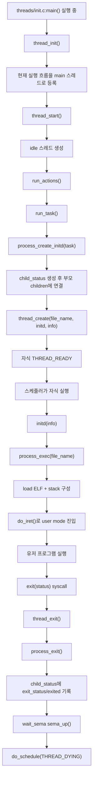
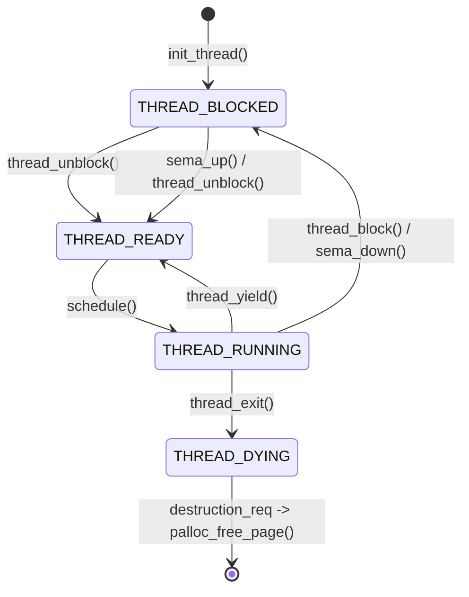

# 최초 스레드와 자식 프로세스 생명주기

## 한 줄 요약

Pintos가 부팅되면 이미 실행 중이던 커널 흐름이 `thread_init()`에서 `"main"` 스레드로 등록된다.

그 뒤 `thread_start()`가 `"idle"` 스레드를 만들고, 커맨드라인의 `run` 액션을 처리할 때 `"main"` 스레드가 `process_create_initd()`를 통해 첫 사용자 프로그램 스레드를 자식으로 만든다.

```text
부팅 직후 실행 흐름

loader.S
  |
  v
threads/init.c:main()
  |
  | thread_init()
  v
현재 실행 중인 커널 스택이 "main" 스레드가 됨
  |
  | thread_start()
  v
"idle" 스레드 생성
  |
  | run_actions() -> run_task()
  v
process_create_initd(task)
  |
  | thread_create(file_name, ..., initd, info)
  v
첫 사용자 프로그램 스레드 생성
```

## 최초 스레드는 어디서 생기나

최초 스레드는 `thread_create()`로 새로 할당되는 스레드가 아니다.

`threads/init.c:main()`이 이미 실행 중인 상태에서 `thread_init()`을 호출하면, 현재 CPU 스택 주소를 기준으로 `struct thread` 위치를 찾아서 그것을 `initial_thread`로 삼는다.

관련 흐름:

```c
// threads/init.c
thread_init ();
```

```c
// threads/thread.c
initial_thread = running_thread ();
init_thread (initial_thread, "main", PRI_DEFAULT);
initial_thread->status = THREAD_RUNNING;
initial_thread->tid = allocate_tid ();
```

그림으로 보면 다음과 같다.

```text
thread_init() 전

현재 CPU는 이미 커널 코드를 실행 중
하지만 Pintos의 thread 시스템에는 아직 등록되지 않음


thread_init() 후

+-------------------------+
| struct thread           |
| name   = "main"         |
| status = THREAD_RUNNING |
| tid    = 1              |
| stack  = 현재 커널 스택 |
+-------------------------+
```

이 스레드가 `threads/init.c:main()`을 계속 실행한다. 그래서 코드 주석에서도 `initial_thread`를 `init.c:main()`을 실행하는 최초 스레드라고 설명한다.

## idle 스레드는 왜 따로 만드나

`thread_start()`는 선점형 스케줄링을 시작하기 전에 `"idle"` 스레드를 만든다.

```c
// threads/thread.c
thread_create ("idle", PRI_MIN, idle, &idle_started);
intr_enable ();
sema_down (&idle_started);
```

`idle` 스레드는 실행할 READY 스레드가 하나도 없을 때 CPU가 갈 곳이다.

```text
ready_list가 비어 있음
  |
  v
next_thread_to_run()
  |
  +-- 비어 있지 않음 -> ready_list 맨 앞 스레드
  |
  +-- 비어 있음 -----> idle_thread
```

## 사용자 프로그램 자식 스레드는 어디서 만들어지나

커널 커맨드라인에 `run something`이 들어오면 `run_actions()`가 `run_task()`를 호출한다.

```c
// threads/init.c
run_actions (argv);

// run_task()
process_wait (process_create_initd (task));
```

여기서 `"main"` 스레드는 부모가 되고, `process_create_initd()`가 첫 사용자 프로그램을 실행할 자식 스레드를 만든다.

```c
// userprog/process.c
tid = thread_create (file_name, PRI_DEFAULT, initd, info);
```

이때 실제로 새 스레드를 만드는 함수는 `thread_create()`다.

```text
"main" 스레드
  |
  | process_create_initd(task)
  v
exec_info 생성
  |
  +-- file_name: 실행할 프로그램 이름 복사본
  |
  +-- status: child_status 객체
             부모의 children 리스트에 연결됨
  |
  v
thread_create(file_name, PRI_DEFAULT, initd, info)
  |
  v
자식 스레드 생성, ready_list에 들어감
```

## thread_create()가 하는 일

`thread_create()`는 새 페이지 하나를 할당해서 그 안에 `struct thread`와 커널 스택을 함께 둔다.

```text
4 kB page 하나

높은 주소
+---------------------------+
| child kernel stack        |
| grows downward            |
|                           |
+---------------------------+
| struct thread             |
| tid                       |
| status                    |
| name                      |
| children                  |
| my_status                 |
| intr_frame tf             |
| magic                     |
+---------------------------+
낮은 주소
```

생성 흐름은 다음 순서다.

```text
thread_create()
  |
  | palloc_get_page(PAL_ZERO)
  v
새 thread 페이지 확보
  |
  | init_thread(t, name, priority)
  v
status = THREAD_BLOCKED
children 리스트 초기화
exit_status = 0
priority 설정
  |
  | allocate_tid()
  v
tid 부여
  |
  | t->tf.rip = kernel_thread
  | t->tf.R.rdi = function
  | t->tf.R.rsi = aux
  v
처음 스케줄될 때 kernel_thread(function, aux)로 시작하도록 준비
  |
  | thread_unblock(t)
  v
status = THREAD_READY
ready_list에 삽입
```

중요한 점은 새 스레드가 `thread_create()` 반환 전에 먼저 실행될 수도 있다는 것이다. 그래서 부모와 자식 사이에 순서 보장이 필요하면 세마포어 같은 동기화가 필요하다.

## 자식 스레드가 사용자 프로그램이 되는 흐름

`process_create_initd()`는 자식의 시작 함수로 `initd`를 넘긴다.

자식 스레드가 스케줄되면 다음 흐름으로 간다.

```text
스케줄러가 자식 선택
  |
  v
kernel_thread(initd, info)
  |
  v
initd(info)
  |
  | thread_current()->my_status = info->status
  v
자식 thread가 자기 child_status를 가리킴
  |
  | process_exec(file_name)
  v
load(file_name, intr_frame)
  |
  +-- pml4_create()
  +-- ELF 파일 열기
  +-- 세그먼트 로드
  +-- 사용자 스택 구성
  +-- argc/argv 세팅
  |
  | do_iret(&_if)
  v
유저 모드의 main(argc, argv)로 진입
```

부모-자식 연결은 `child_status` 하나를 공유해서 관리한다.

```text
부모 thread
+----------------------+
| name = "main"        |
| children list        |
|   |                  |
|   v                  |
| child_status         |
| tid                  |
| exit_status          |
| waited               |
| exited               |
| is_orphan            |
| wait_sema            |
+----------------------+
          ^
          |
          | my_status
          |
+----------------------+
| 자식 thread          |
| name = 실행 파일명   |
| my_status ---------- |
| exit_status          |
+----------------------+
```

## 부모가 wait할 때 변하는 것

`run_task()`의 부모 스레드, 즉 `"main"`은 다음처럼 바로 기다린다.

```c
process_wait (process_create_initd (task));
```

`process_wait(child_tid)`는 현재 스레드의 `children` 리스트에서 `child_tid`와 같은 `child_status`를 찾는다.

```text
process_wait(child_tid)
  |
  v
current->children 순회
  |
  +-- child_tid 없음
  |     v
  |   -1 반환
  |
  +-- 이미 waited == true
  |     v
  |   -1 반환
  |
  +-- 찾음
        |
        | waited = true
        v
      child->exited ?
        |
        +-- false -> sema_down(&child->wait_sema)
        |            부모 BLOCKED
        |
        +-- true  -> 바로 exit_status 회수
        |
        v
      list_remove(&child->elem)
      palloc_free_page(child)
      exit_status 반환
```

부모가 `sema_down()`으로 잠들면 부모 스레드 상태는 `THREAD_BLOCKED`가 되고, 스케줄러가 다른 스레드를 실행한다.

```text
부모 wait 전

부모: THREAD_RUNNING
자식: THREAD_READY 또는 THREAD_RUNNING


부모가 sema_down()으로 기다림

부모: THREAD_BLOCKED
자식: THREAD_RUNNING 가능


자식 종료 후 sema_up()

부모: THREAD_READY
이후 스케줄되면 wait에서 깨어남
```

## 자식이 죽을 때 변하는 것

유저 프로그램이 `exit(status)` 시스템콜을 호출하면 다음 흐름으로 종료된다.

```text
user exit(status)
  |
  v
syscall_handler()
  |
  v
sys_exit(status)
  |
  | curr->exit_status = status
  v
thread_exit()
  |
  v
process_exit()
  |
  v
부모에게 종료 상태 알림
  |
  v
process_cleanup()
  |
  v
do_schedule(THREAD_DYING)
```

`process_exit()`에서 자식은 자신의 `my_status`를 통해 부모에게 종료 사실을 남긴다.

```c
curr->my_status->exit_status = curr->exit_status;
curr->my_status->exited = true;
sema_up (&curr->my_status->wait_sema);
```

그림으로 보면 다음과 같다.

```text
자식 종료 전

child_status
+------------------+
| tid = child_tid  |
| exit_status = 0  |
| waited = true    |
| exited = false   |
| wait_sema = 0    |
+------------------+


자식 process_exit() 후

child_status
+---------------------+
| tid = child_tid     |
| exit_status = 7     |
| waited = true       |
| exited = true       |
| wait_sema sema_up() |
+---------------------+

부모는 sema_down()에서 깨어나 exit_status를 읽고 child_status를 해제한다.
```

그 다음 `thread_exit()`은 인터럽트를 끄고 `do_schedule(THREAD_DYING)`을 호출한다.

```text
thread_exit()
  |
  | process_exit()
  v
process 자원 정리
  |
  | intr_disable()
  v
do_schedule(THREAD_DYING)
  |
  | current->status = THREAD_DYING
  v
schedule()
  |
  | 다음 스레드 선택
  v
thread_launch(next)
```

`schedule()`은 이전 스레드가 `THREAD_DYING`이면 바로 해제하지 않고 `destruction_req`에 넣는다. 지금 사용 중인 커널 스택이 바로 그 스레드 페이지 안에 있기 때문이다.

```text
죽는 스레드 페이지

+---------------------------+
| 현재 thread_exit()가 쓰는 |
| 커널 스택                 |
+---------------------------+
| struct thread             |
+---------------------------+

아직 이 페이지를 바로 free하면 안 됨
그래서 destruction_req에 넣고,
다음 스케줄 시점에 다른 스택에서 palloc_free_page() 한다.
```

## 부모가 먼저 죽을 때 변하는 것

부모도 `thread_exit()`을 타면 `process_exit()`에서 자기 자식 목록을 정리한다.

현재 코드의 의도는 다음과 같다.

```text
부모 process_exit()
  |
  v
while (!list_empty(&curr->children))
  |
  +-- child->exited == true
  |     v
  |   child_status를 바로 free
  |
  +-- child->exited == false
        v
      child->is_orphan = true
```

즉, 이미 죽은 자식의 상태 객체는 부모가 회수하고, 아직 살아 있는 자식은 고아 상태로 표시한다.

그 뒤 고아 자식이 나중에 죽으면 `process_exit()`에서 다음 분기로 들어간다.

```c
if (curr->my_status->is_orphan) {
  palloc_free_page (curr->my_status);
  curr->my_status = NULL;
}
```

그림으로 보면 다음과 같다.

```text
부모가 먼저 종료

부모 children list
  |
  +-- 이미 종료한 자식 status -> free
  |
  +-- 아직 실행 중인 자식 status -> is_orphan = true


고아 자식이 나중에 종료

자식 my_status
  |
  +-- is_orphan == true
        |
        v
      부모에게 sema_up 할 대상이 없으므로
      child_status를 자식이 직접 free
```

## 전체 상태 전이 그림





## 코드 볼 때 체크할 지점

- `threads/init.c:main()`은 Pintos의 부팅 후 커널 진입점이다.
- `thread_init()`은 현재 실행 흐름을 `"main"` 스레드로 등록한다.
- `thread_start()`는 `"idle"` 스레드를 만들고 인터럽트를 켜서 선점 스케줄링을 시작한다.
- `run_task()`는 `process_wait(process_create_initd(task))`로 첫 사용자 프로그램을 실행하고 기다린다.
- `process_create_initd()`는 `child_status`를 만든 뒤 `thread_create()`로 자식 스레드를 만든다.
- `initd()`는 자식 스레드 안에서 `process_exec()`을 호출해 ELF를 로드하고 유저 모드로 넘어간다.
- `process_wait()`는 부모의 `children` 리스트에서 자식을 찾고, 아직 종료 전이면 `wait_sema`에서 잔다.
- `process_exit()`은 자식 종료 시 부모에게 `exit_status`, `exited`, `sema_up()`으로 알린다.
- 부모가 먼저 죽으면 살아 있는 자식의 `child_status`는 `is_orphan = true`가 되고, 나중에 자식이 직접 해제한다.

## 현재 코드에서 조심할 점

`pintos/include/threads/thread.h`의 `struct thread` 안에는 `exit_status`가 두 번 선언되어 있다.

```c
int exit_status; /*종료 메시지*/
...
int exit_status;
```

C 구조체 안에서 같은 이름의 필드를 두 번 선언할 수 없으므로, 현재 상태 그대로라면 컴파일 에러가 날 가능성이 크다. 하나만 남겨야 한다.

또 `process_fork()`와 `__do_fork()` 쪽은 아직 TODO가 많이 남아 있다. 이 문서의 부모-자식 흐름은 현재 구현된 `process_create_initd()`, `process_wait()`, `process_exit()` 중심으로 보면 된다.
